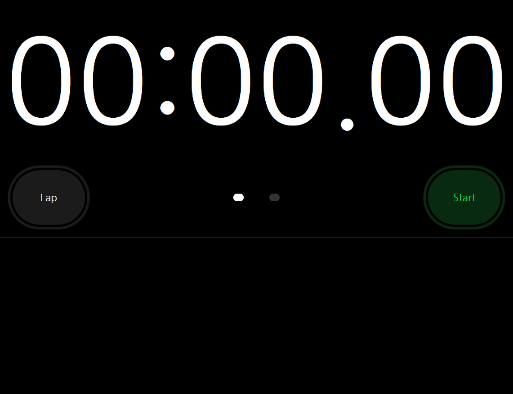
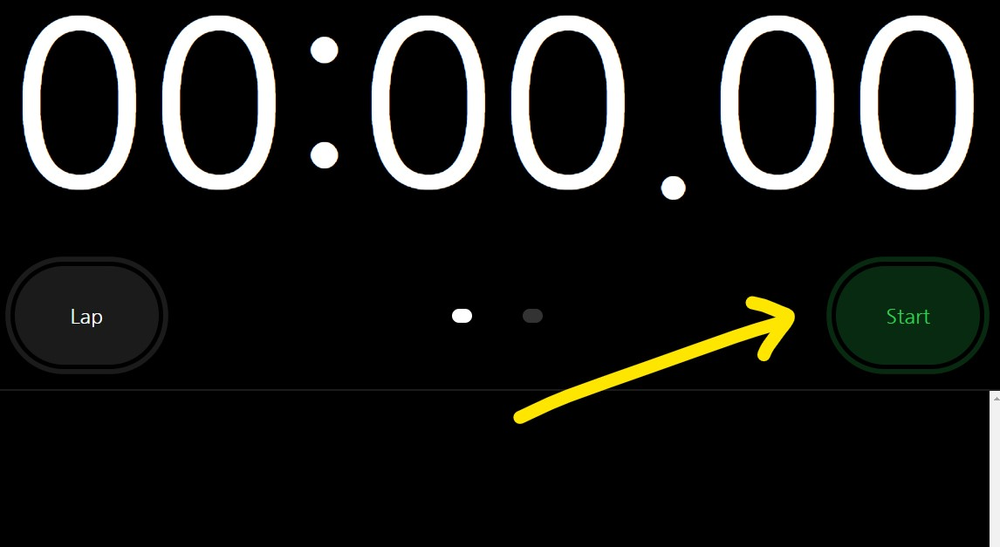
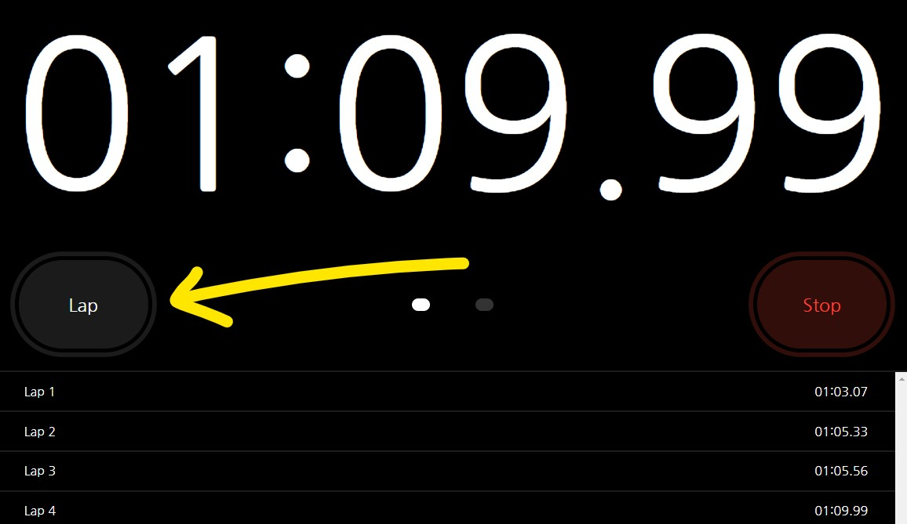
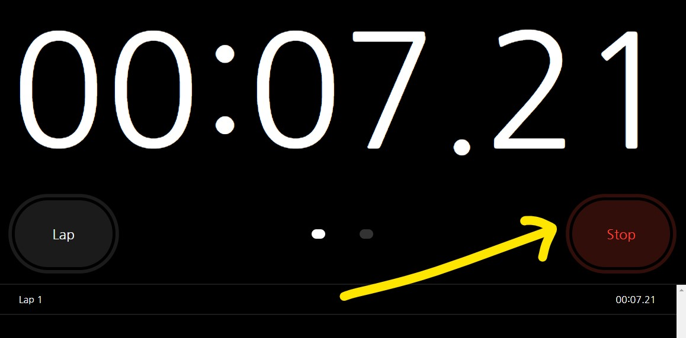
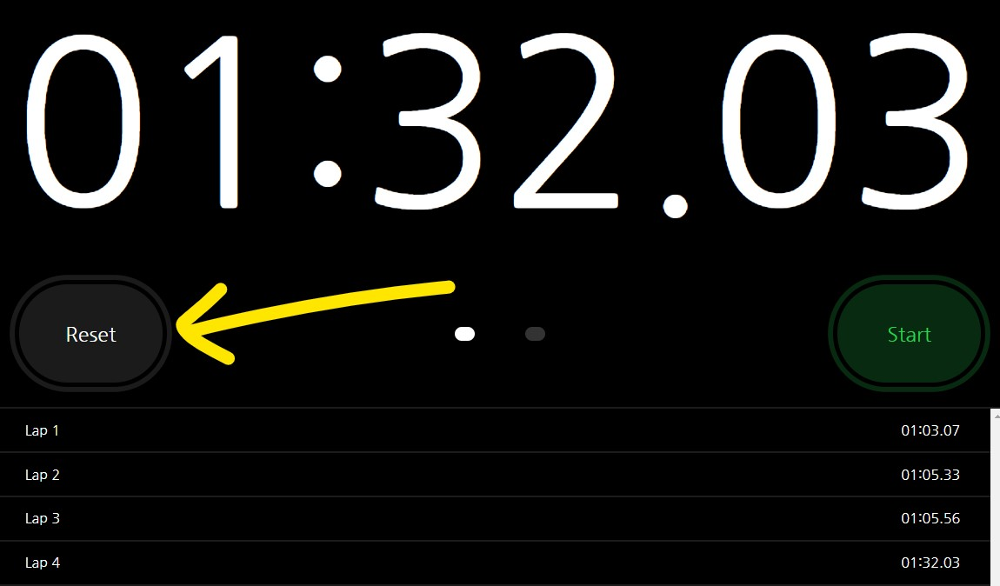
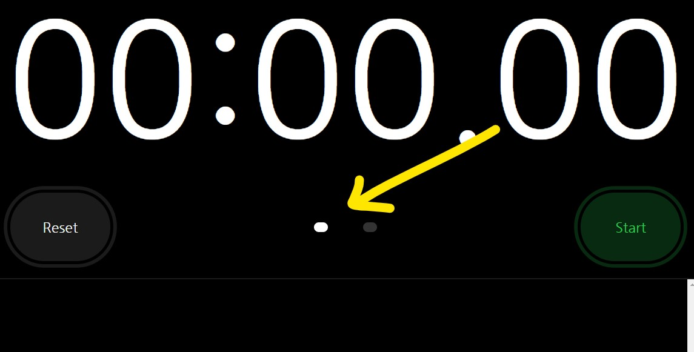
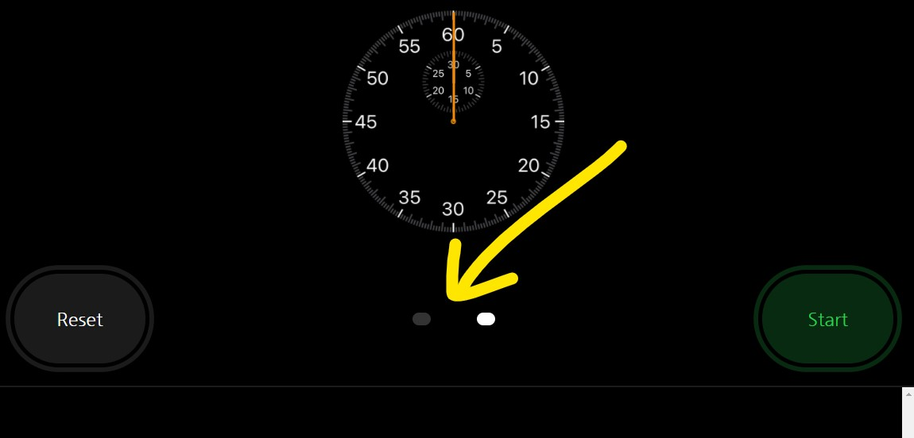

# Stopwatch

## Table of Contents
- [Project Goal](##Project-Goal)
- [Links](##Links)
- [Implemented Technologies](##Implemented-Technologies)
- [Screenshot of Application](##Screenshot-of-Application)
- [User Instructions](##User-instructions)
- [Acknowledgements](##Acknowledgements)

## Project Goal
The goal for this project include: 
1.  To replicate both the functionality and display of an iPhone stopwatch. 
2.  For the page to be responsive to multiple screensizes.

## Implemented Technologies
- Vanilla JavaScript
- APIs 
- Advanced CSS3
- Responsive Design
- HTML5

## Links
- ### [URL to Deployed Application](https://inklein1997.github.io/Stopwatch-iPhone-Clone/)
- ### [URL to Github Repository](https://github.com/inklein1997/Stopwatch-iPhone-Clone)

## Screenshot of Webpage

## User Instructions
1. **Click "Start"** to start the stopwatch.  
 
2. **Click "Lap"** to record and display lap times. 
 
3. **Click "Stop"** to pause the timer. 
 
4. **Click "Reset"** to set the stopwatch back to 00:00.00. 
 
5. The user may toggle between a **digital stopwatch** and a **analog stopwatch** by **clicking between the two white dots** in the center of the page. 
  

## Acknowledgements
This display was based off Apple's stopwatch application.  The creator does not claim any rights to the design of this interface.